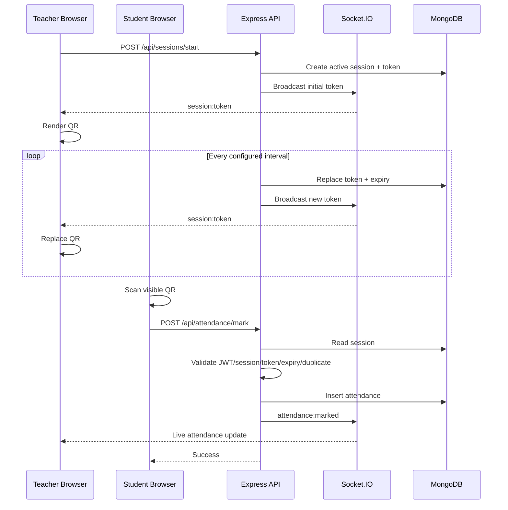

# System Architecture — QR Attendance System

## 1. Architecture Summary

The application uses a three-tier MERN architecture:

```text
┌─────────────────────────────────────────────────────────────┐
│                        CLIENT LAYER                         │
│                                                             │
│  Teacher React Console             Student React Console    │
│  - Session control                - QR scanner              │
│  - QR display                     - Attendance result       │
│  - Live attendance                - Attendance history      │
└───────────────┬─────────────────────────┬───────────────────┘
                │ HTTPS REST               │ HTTPS REST
                │                          │
                └──────────────┬───────────┘
                               ▼
┌─────────────────────────────────────────────────────────────┐
│                       APPLICATION LAYER                     │
│                                                             │
│  Node.js + Express                                          │
│  ├── Authentication / JWT                                   │
│  ├── Role authorization                                     │
│  ├── Course service                                         │
│  ├── Session service                                        │
│  ├── QR token service                                       │
│  ├── Attendance service                                     │
│  └── CSV export                                             │
│                                                             │
│  Socket.IO                                                  │
│  ├── QR rotation broadcast                                  │
│  └── Live attendance events                                 │
└──────────────────────────┬──────────────────────────────────┘
                           │
                           ▼
┌─────────────────────────────────────────────────────────────┐
│                         DATA LAYER                           │
│                                                             │
│                     MongoDB + Mongoose                      │
│                                                             │
│  Users | Courses | Sessions | Attendance                    │
└─────────────────────────────────────────────────────────────┘
```

The original technical design describes React teacher/student views communicating with a Node.js/Express API, JWT security, Socket.IO for QR/live updates, and MongoDB Atlas for persistent records. fileciteturn0file0L110-L115

---

## 2. Components

### 2.1 React Frontend

Responsibilities:

- Render authentication pages.
- Render role-specific dashboards.
- Access browser camera for QR scanning.
- Render QR codes for teachers.
- Connect to REST APIs.
- Maintain authenticated client state.
- Connect to Socket.IO.
- Display attendance results.
- Display attendance history and percentages.
- Provide CSV download.

Technology baseline:

- React.js
- React Router
- Axios
- `qrcode.react`
- Browser HTML5 camera/scanning capability

The technology table in the source identifies React, React Router, Axios, QR rendering, and HTML5 QR scanning as the frontend responsibilities. fileciteturn0file0L116-L119

### 2.2 Express API

Responsibilities:

- Authentication.
- Authorization.
- Course management.
- Session lifecycle.
- Attendance validation.
- Attendance persistence.
- Attendance queries.
- CSV generation.

### 2.3 JWT Middleware

Every protected request carries a JWT.

Middleware responsibilities:

1. Extract token.
2. Verify signature.
3. Decode user identity and role.
4. Attach authenticated user to request.
5. Reject invalid/expired tokens.
6. Allow role-specific middleware to continue.

### 2.4 Socket.IO

Socket.IO provides real-time communication.

Primary events:

```text
session:token
attendance:marked
session:started
session:stopped
```

The exact event names can be adjusted during implementation; the required behavior is live QR rotation and live attendance updates.

### 2.5 MongoDB

MongoDB stores:

- Users.
- Courses.
- Sessions.
- Attendance records.

Mongoose provides schema validation and ObjectId references.

---

## 3. Authentication Flow

```text
User
 │
 │ POST /api/auth/login
 ▼
Express
 │
 ├── Find user
 ├── Compare password with bcrypt
 ├── Create JWT
 │
 ▼
JWT returned
 │
 ▼
React stores authenticated session
 │
 └── Sends JWT on protected API calls
```

Passwords are required to be hashed with bcrypt and authentication uses JWT according to the source design. fileciteturn0file0L97-L104

---

## 4. Teacher Session Flow

```text
Teacher
  │
  │ Start session
  ▼
POST /api/sessions/start
  │
  ▼
Create Session
  │
  ├── isActive = true
  ├── currentToken = random token
  └── tokenExpiresAt = now + 8 sec
  │
  ▼
Socket.IO
  │
  ▼
Teacher browser
  │
  ▼
QR rendered
  │
  ├── wait ~8 sec
  ▼
Server generates new token
  │
  ▼
Socket.IO broadcast
  │
  ▼
QR replaced
```

The source specifies an 8-second default rotation and server-side token regeneration. fileciteturn0file0L131-L142

---

## 5. Student Attendance Flow

```text
Student opens scanner
        │
        ▼
Camera reads QR
        │
        ▼
sessionId + token
        │
        ▼
POST /api/attendance/mark
        │
        ▼
JWT middleware
        │
        ▼
Attendance validation
        │
        ├── Session active?
        ├── Token matches?
        ├── Token unexpired?
        ├── Student enrolled?
        └── Already marked?
             │
       ┌─────┴─────┐
       │           │
      NO          YES
       │           │
       ▼           ▼
   Error        Create record
                   │
                   ▼
             Socket.IO event
                   │
                   ▼
             Teacher dashboard
```

The PRD explicitly requires session-active, token-match, expiry, and duplicate checks before attendance creation. fileciteturn0file0L84-L92

---

## 6. QR Token Model

The QR should contain only the minimum information needed by the backend:

```json
{
  "sessionId": "<session-object-id>",
  "token": "<short-lived-random-token>"
}
```

Do not put the student's identity, password, JWT, or sensitive course data in the QR.

### Token properties

- Generated server-side.
- Cryptographically random.
- Associated with one session.
- Short-lived.
- Replaced periodically.
- Validated against server-side session state.
- Never trusted solely because it was decoded successfully.

---

## 7. Sequence Diagram



---

## 8. Failure Handling

### Expired token

Return a client-readable error such as:

```json
{
  "success": false,
  "code": "QR_EXPIRED",
  "message": "QR expired, please rescan"
}
```

### Duplicate

```json
{
  "success": false,
  "code": "ALREADY_MARKED",
  "message": "Attendance already marked for this session"
}
```

### Closed session

```json
{
  "success": false,
  "code": "SESSION_CLOSED",
  "message": "This attendance session is closed"
}
```

### Unauthorized

```json
{
  "success": false,
  "code": "UNAUTHORIZED",
  "message": "Authentication required"
}
```

---

## 9. Scalability

The source non-functional target is at least 200 concurrent students scanning within a session window, with an average QR validation response under 300 ms. fileciteturn0file0L97-L104

Implementation considerations:

- Index attendance by `(sessionId, studentId)`.
- Avoid expensive population during the critical attendance-marking path.
- Keep attendance validation synchronous and small.
- Use Socket.IO only for events that need realtime behavior.
- Keep API instances stateless so they can scale horizontally later.
- If multiple backend instances are eventually deployed, use a Socket.IO adapter/shared broker so broadcasts reach all relevant clients.
- Load-test bursts rather than only average traffic.

---

## 10. Browser Refresh Behavior

Teacher refresh must not destroy attendance data.

Required behavior:

1. Browser reconnects.
2. Frontend asks backend for the active session.
3. Backend reads session from MongoDB.
4. Frontend restores session state.
5. Socket reconnects.
6. Teacher continues viewing the current session.

The source explicitly requires attendance data to persist even when the teacher refreshes the browser mid-session. fileciteturn0file0L97-L104

---

## 11. Security Boundaries

```text
PUBLIC
 ├── register
 └── login

AUTHENTICATED
 ├── course read
 ├── student attendance
 └── personal attendance

TEACHER
 ├── create course
 ├── start session
 ├── stop session
 ├── view session attendance
 └── export attendance
```

Authorization must be checked server-side. Hiding a button in React is not sufficient.

---

## 12. Deployment Architecture

Demo-oriented deployment described in the source:

```text
Browser
  │
  ├── HTTPS
  ▼
Vercel/Netlify
  │
  │ API requests / WebSocket
  ▼
Render/Railway
  │
  ▼
MongoDB Atlas
```

The source identifies Vercel/Netlify for frontend hosting and Render/Railway for backend hosting. fileciteturn0file0L123-L130
